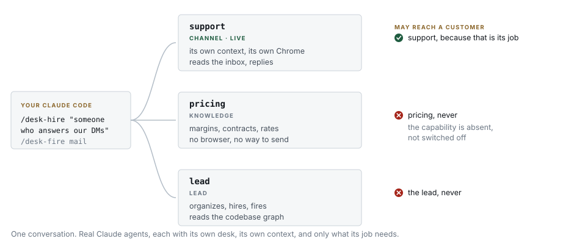

# 🏢 Office-Anything

<div align="center">

**A Claude Code plugin for hiring and firing AI agents. Each gets a desk, a browser, and
limits that are enforced, not suggested.**


[Install](#install) · [Hire](#hire-someone) · [Try](#try-something-without-letting-it-in) ·
[Fire](#fire-someone) · [The wall](#the-wall) · [The checks](#the-checks) · [The board](#the-board) ·
[Design](#design-philosophy) · [Roadmap](#roadmap)



<b><a href="https://hoangnv1301.github.io/Office-Anything/">See it work &rarr;</a></b><br>
<sub>Pick a desk, try to give it a job that isn't its own, and watch it refuse.</sub>

</div>

## Why Office-Anything?

If you run more than one AI agent, you have met these:

- 💸 **One agent does everything** — so the same context that holds your margins is the one
  chatting with a customer, and nothing but its mood keeps the two apart.
- 🔥 **Removing an agent breaks three others** — a name in a config here, a hardcoded port
  there, and the first evidence is a customer nobody answered.
- 🧪 **"Let me just try this library"** — and a week later its files are in your dotfiles,
  your PATH, and two configs you did not know you had.
- 📗 **The docs describe the setup you wished you had** — while what actually runs drifted
  months ago, and no command exists that would tell you.
- 🤝 **A new agent gets pasted rules** — "never quote prices" — that last exactly until the
  conversation gets interesting.

Office-Anything's answer is a **desk**: one folder, one `desk.json` contract, one browser
profile, one agent — with the dangerous capability *absent*, not switched off, and a set of
checks that audit the whole office with one exit code.

## Install

```bash
/plugin install office-anything@office-anything
```

Restart Claude Code once so the hooks arm, and you are set. The plugin stays
quiet until your repo has a `desks/` directory — hire your first desk and
everything switches on together.

## Hire someone

```
/desk-hire "someone who answers our Instagram DMs"
```

```
  reads it   →  kind: channel
  issues     →  a folder, its own Chrome, a reader, a voice standard
  withholds  →  a sender. It starts dark.

  ⛔ chat: facts.md is still the stub. This desk knows nothing.
```

A new desk starts as a clean slate and tells you exactly what to teach it
first — write its `facts.md` and it is ready to work. You always know what a
desk knows, because you gave it every fact it has.

<details>
<summary><b>Why hiring needs two readers to agree</b></summary>

The model decides the desk's kind, because reading intent from a sentence is a model's job.
A second, independent reading then forms its own view, and `hire` **refuses** if they
differ or the description is ambiguous. `"quotes prices to customers"` mentions both
customers and internal figures, so it stops and asks rather than picking one. That call
decides who may talk to a customer, which makes it the one place a second opinion earns
its cost.

</details>

## Try something without letting it in

You have a list of repos you want to try and no appetite for what they do to your setup.

```
/desk-try "that scraping library everyone keeps posting about"
```

It hires a desk for the trial, installs everything **inside that desk**, and writes down
what it brought. You talk to the desk about it, not to your main session. When you are
done, `/desk-fire` it — and a check confirms it left nothing behind:

```
⛔ 1 file(s) a desk brought in are living outside it
   some-scraper installed "cool-lib", which is at config/cool-lib.rc

   Firing that desk will not remove these.
```

> 💡 A desk isolates a folder, a browser profile and an agent's context, and makes
> removal verifiable. For genuinely untrusted code, pair it with a container.

## Fire someone

```
/desk-fire chat --reason "the channel is being retired this quarter"
```

Clean offboarding, built in: it checks nothing still depends on the desk,
archives rather than deletes, and walks you through the handover — close its
session, rehome its knowledge, reassign its open work. The reason you give is
recorded, so six months later you still know why.

## The wall

Some agents should never be able to talk to a customer, no matter how the conversation
goes. A **knowledge** desk holds prices, margins and contracts. A **channel** desk talks
to people. The wall between them is that a knowledge desk has **no way to send** — the
capability is absent, not switched off.

| gets | channel | knowledge | lead |
|---|---|---|---|
| its own browser, visible on screen | ✅ | — | ✅ |
| a reader for its channel | ✅ | — | — |
| a voice standard it has to pass | ✅ | — | — |
| **a way to send** | only once you make it live | **never** | never |
| the codebase-graph tool | — | — | ✅ |

The wall is enforced by a hook, so it blocks the write instead of reporting it afterwards:

```
⛔ BLOCKED. pricing is a KNOWLEDGE desk and you are giving it a way to send.

If this desk genuinely needs to talk to people, it is the wrong kind. Change its
kind in desks/pricing/desk.json deliberately, where somebody reviews it.
```

It is checked both ways: a live channel desk with **no** way to send fails just as loudly,
because that means someone is being ignored.

## The checks

One command audits any repo that carries desks, from anywhere:

```bash
node checks/run.mjs ~/code/some-repo    # every check, one exit code
```

| check | answers |
|---|---|
| `desk-readable` | can every desk be read, and does any port get claimed twice |
| `send-wall` | can a desk that should not reach a customer, reach one |
| `unfinished` | is a desk still wearing the stubs it was hired with |
| `stray-writes` | did a desk leave anything outside its own folder |
| `stated-numbers` | does every number this project states about itself match reality |
| `desk-literals` | can a desk be added or removed without editing a root test |
| `commit-convention` | does every commit since adoption say what kind of change it is |

Exit 0 clean, 4 finding, 7 UNKNOWN — and **an empty walk is UNKNOWN, never clean**.

The last two are opt-in ratchets, one committed file each, and they start at the adopting
commit: history before it is somebody else's style and is left alone. Pin your counts in
`tests/desk-literals.json`; adopt typed commits (`feat:`, `fix:`, `chore:`, …) by
committing `conventions.json` with `{"commits": "conventional"}`.

## The board

```
/desk-board
```

The office on one page, served read-only on localhost: every desk with its
kind, live status, model, turns, token usage and last activity — read from
desk.json and the desks' own transcripts, never from self-report — plus each
desk's worktop (its session's native Claude Code scratchpad) and the full
checks board. The front page IS the conversation view: every desk (the lead included) in a
sidebar, its live transcript streaming as chat on the right, and a send box
that types straight into that desk's terminal where the host supports it.
Loopback only, stateless, re-gathered per request. It cannot
know something `node checks/run.mjs` does not, which is the rule that let it
exist at all.

## Design philosophy

**A check reports after the fact, if somebody runs it. A hook blocks the action.** They
are different jobs and this repo refuses to merge them: the check exists so you can audit
a repo you did not write, the hook exists because the audit is too late.

| rule | why it is a rule |
|---|---|
| a check that only reports is not a gate | if it matters, it exits non-zero |
| an empty walk is UNKNOWN, never clean | a checker that examined nothing has not passed |
| every override costs a recorded reason | `--reason` under 20 characters is refused |
| ports are declared, never derived | deriving them renumbered every desk after an insert — four incidents |
| one question, one owner | two copies of a fact means one is stale and you cannot tell which |
| a test that has never failed has never been checked | break the guarantee, watch red, restore |

Every fault in the [CHANGELOG](CHANGELOG.md) was found by **using** the plugin — hiring,
firing, deliberately breaking desks — not by reading it. Four of the first five needed a
desk to exist and a second action taken against it.

## Security

No network. No telemetry. Checks read the audited repo and write nothing. Credentials are
never read, and a finding about a leak names the location, never the value. The full
statement, including what `hire`/`fire` may write and where: [SECURITY.md](SECURITY.md).

## In production

The contract runs a real customer-service office: seven desks across five channels
(web chat, email, three marketplaces) in front of a 2,500-test suite. v0.3.0 exists
because that deployment found faults that reading never would — see the
[release notes](https://github.com/hoangnv1301/Office-Anything/releases/tag/v0.3.0).

## Roadmap

- **`state-shape`** — state files sorted by lifetime (the FHS names: `run/ lib/ log/
  cache/ spool/`), so "can I delete this" has an answer by construction.
- **A home for the `lead` kind** — a root-level desk, so the desk that runs the office
  stops being invisible to its own checks.
- **A local dashboard** — the office on one page, read-only, served from what the checks
  already know.
- **Other harnesses** — the contract is one JSON file per desk on purpose. Nothing in
  `desk.json` is Claude-specific; adapters for other agent CLIs are a matter of hooks,
  not of contract.

## Contributing

Typed commits, one grammar enforced in two places, and every claim the README makes is
pinned by a test — including this one. Start at [CONTRIBUTING.md](CONTRIBUTING.md).

## Acknowledgments

- Repo structure and release style informed by
  [Agent-Reach](https://github.com/Panniantong/Agent-Reach).
- Built on what [Claude Code](https://claude.com/claude-code) already provides — hooks,
  slash commands, plugins, subagents. Nothing here reimplements any of it.

## Star history

<a href="https://star-history.com/#hoangnv1301/Office-Anything&Date">
  
</a>

---

<div align="center">
<sub>MIT · <a href="CHANGELOG.md">changelog</a> · <a href="CONTRIBUTING.md">contributing</a> ·
<a href="SECURITY.md">security</a> · <a href="https://hoangnv1301.github.io/Office-Anything/">live demo</a></sub>
</div>
